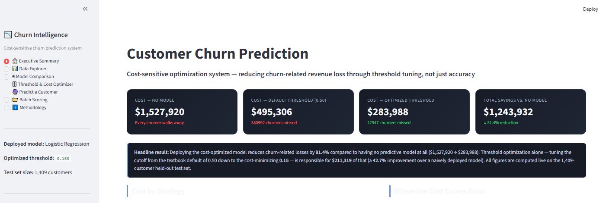
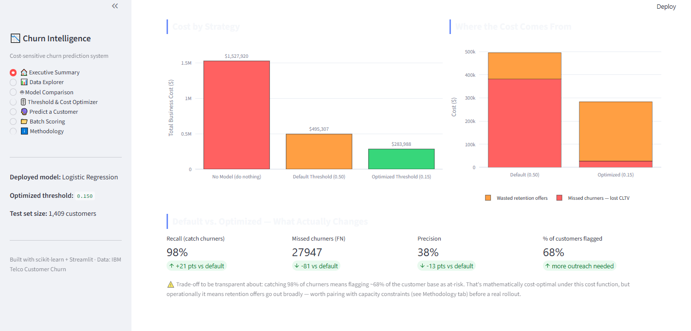
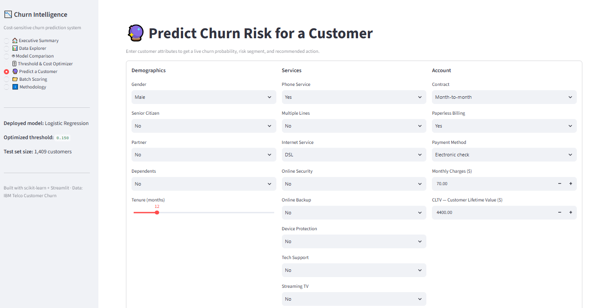
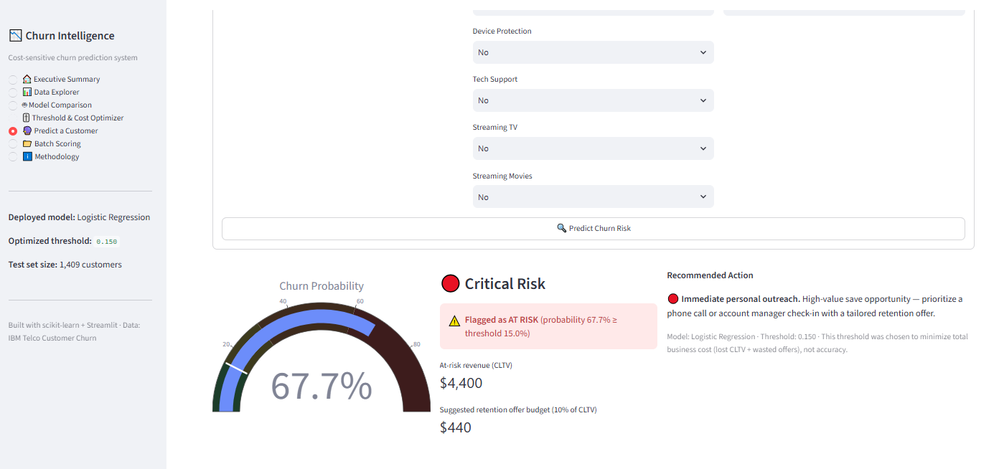
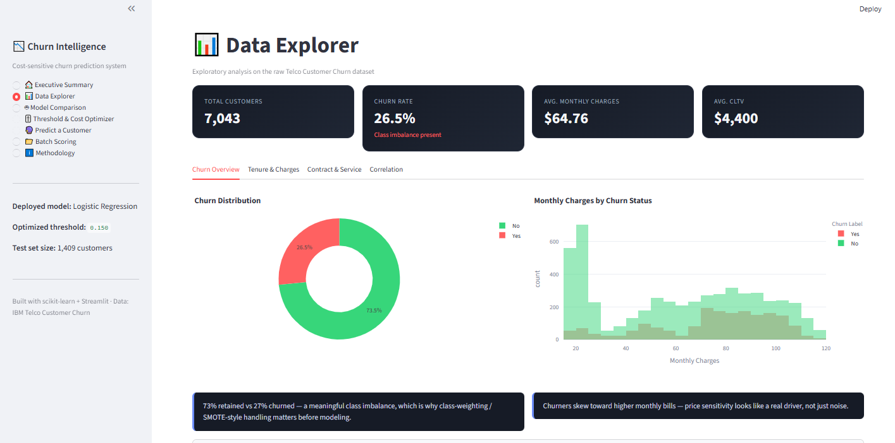
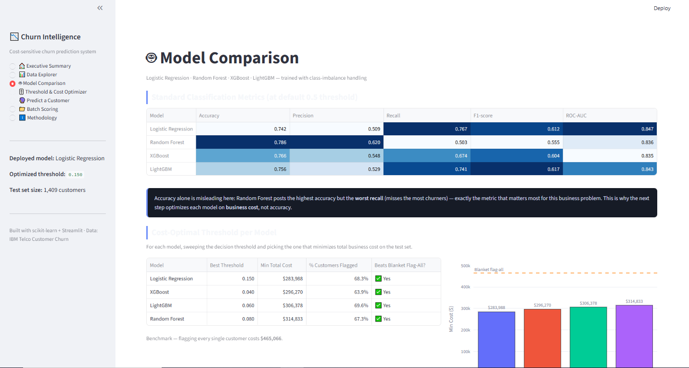
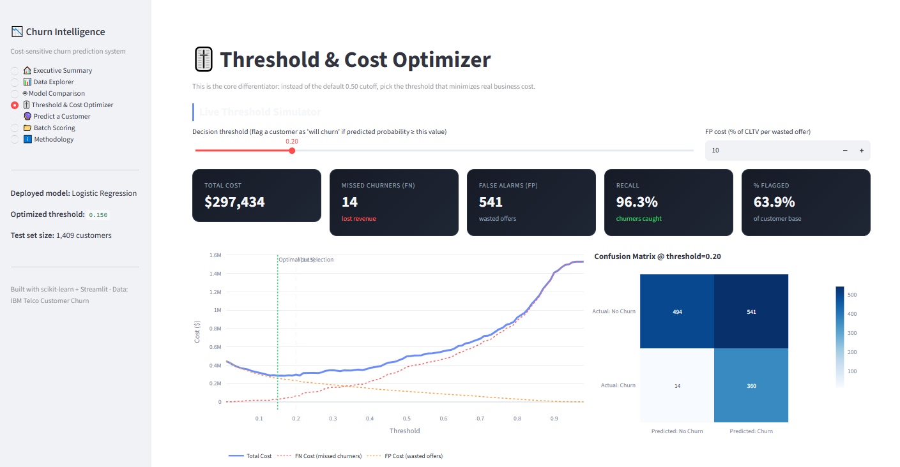
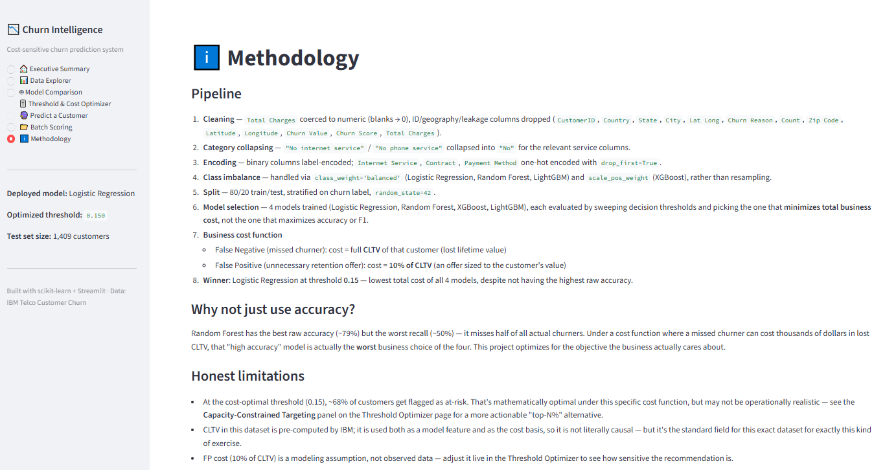
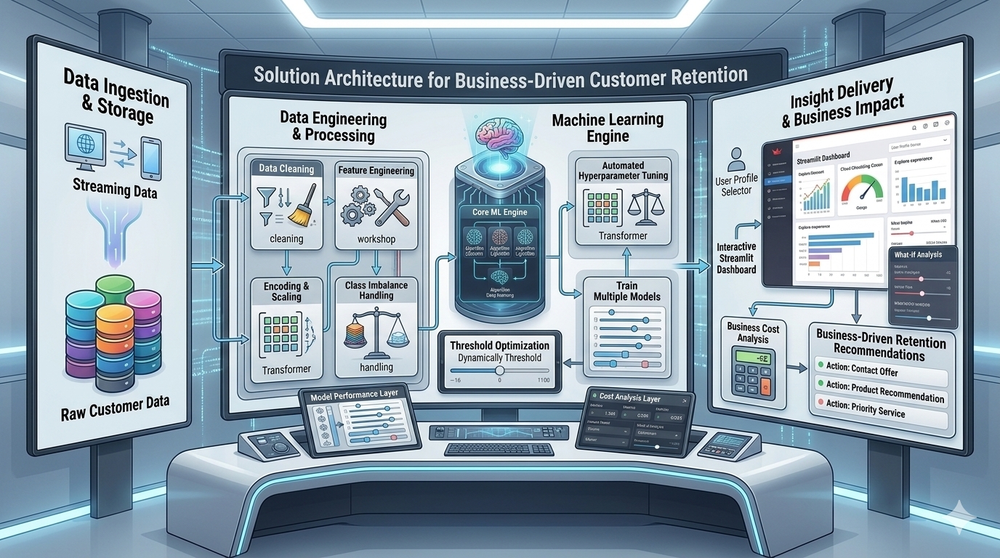

# 💼 Cost-Sensitive Customer Churn Prediction

> **End-to-End Machine Learning System for Customer Retention with Business Cost Optimization**

<p align="center">


</p>

---

# 📖 Overview

Customer churn is one of the most critical challenges for subscription-based businesses. Instead of focusing solely on prediction accuracy, this project applies **cost-sensitive machine learning** to optimize business outcomes.

The system identifies customers who are likely to churn, evaluates the financial impact of prediction errors, tunes the classification threshold based on business cost, and provides an interactive dashboard for retention decision-making.

---

# 🚀 Key Features

- 📊 Exploratory Data Analysis (EDA)
- 🧹 Data Cleaning & Preprocessing
- ⚙️ Feature Engineering
- ⚖️ Class Imbalance Handling
- 🤖 Multiple Machine Learning Models
- 🎯 Threshold Optimization
- 💰 Business Cost Function
- 📈 ROI & Revenue Loss Analysis
- 📉 Confusion Matrix Analysis
- 📊 Interactive Streamlit Dashboard
- 👤 Individual Customer Scoring
- 📂 Batch Customer Prediction
- 📋 Data Quality Dashboard

---

---

# 📸 Dashboard Preview

Experience the interactive Streamlit dashboard designed to transform churn predictions into actionable business insights.

## 🏠 Executive Overview

<p align="center">


</p>

> Monitor customer churn rate, risk distribution, flagged customers, and total CLTV exposure through an executive-friendly dashboard.

---

## 🔍 Risk Explorer

<p align="center">


</p>

> Filter customers by risk level, contract type, and churn probability to generate targeted retention action lists.

---

## 💰 Business Impact Dashboard

<p align="center">

</p>

> Compare intervention strategies, estimate financial exposure, optimize retention costs, and evaluate projected savings.

---

## 📊 Model Comparison

<p align="center">

</p>

> Score individual models, predict churn probability, assign risk segments, and support retention decisions.

---

## 🚀 Threshold and Cost-Optimizer

<p align="center">

</p>

> Optimizes a ML classification threshold to balance missed churners against false alarms, minimizing total financial costs for the business.

---

## 🎥 Methodology

<p align="center">

</p>

> outlines the data preparation, modeling, and cost-focused evaluation strategy used to build and select the optimal churn prediction system.

---

# 🏗️ Solution Architecture

<p align="center">

</p>

The solution follows an end-to-end machine learning workflow—from raw customer data ingestion to business-driven retention recommendations delivered through an interactive Streamlit dashboard.

---


# 🧠 Machine Learning Pipeline

```text
Raw Customer Data
        │
        ▼
Data Cleaning
        │
        ▼
Feature Engineering
        │
        ▼
Encoding & Scaling
        │
        ▼
Class Imbalance Handling
        │
        ▼
Train Multiple Models
        │
        ▼
Model Evaluation
        │
        ▼
Threshold Optimization
        │
        ▼
Business Cost Analysis
        │
        ▼
Model Deployment (Streamlit)
```

---

# 🏆 Models Compared

- Logistic Regression
- Random Forest
- XGBoost
- LightGBM

The best-performing model is selected based on predictive performance and business impact rather than accuracy alone.

---

# 💰 Business-Oriented Optimization

Unlike traditional churn prediction projects, this solution evaluates the financial impact of model decisions.

The optimization considers:

- False Positive Cost
- False Negative Cost
- Customer Lifetime Value (CLTV)
- Decision Threshold Optimization
- Revenue Loss Estimation
- Retention ROI

This enables data-driven retention strategies instead of relying on a default 0.5 classification threshold.

---

# 📊 Dashboard Features

The Streamlit application includes:

### 📈 Executive Overview

- Customer churn rate
- Customers flagged for retention
- CLTV exposure
- Risk distribution

### 🔍 Risk Explorer

- Filter customers by risk level
- Contract type analysis
- Probability threshold filtering
- Export retention action lists

### 👤 Customer Scoring

- Predict churn probability for a single customer
- Risk categorization
- Retention recommendation

### 💰 Business Impact

- Compare intervention strategies
- Revenue exposure
- Estimated savings
- Offer investment analysis

### 📋 Data Quality

- Missing values
- Dataset statistics
- Column summaries
- Data profiling

---

# 📂 Project Structure

```text
Cost-Sensitive-Churn-Prediction/
│
├── artifacts/
│   ├── churnmodel.pkl
│   ├── modelcolumns.pkl
│   ├── bestthreshold.pkl
│   └── labelencoders.pkl
│
├── assets/
│   ├── overview.png
│   ├── risk-explorer.png
│   ├── customer-scoring.png
│   ├── business-impact.png
│   ├── data-quality.png
│   ├── model-pipeline.png
│   └── demo.gif
│
├── data/
│   ├── raw/
│   └── processed/
│
├── notebooks/
│   └── churn_prediction.ipynb
│
├── app.py
├── requirements.txt
├── README.md
├── LICENSE
└── .gitignore
```

---

# ⚙️ Installation

Clone the repository

```bash
git clone https://github.com/yourusername/Cost-Sensitive-Churn-Prediction.git
```

Move into the project

```bash
cd Cost-Sensitive-Churn-Prediction
```

Install dependencies

```bash
pip install -r requirements.txt
```

---

# ▶️ Run the Dashboard

```bash
streamlit run app.py
```

---

# 📈 Dataset

This project uses the **Telco Customer Churn Dataset**, which contains customer demographics, subscription information, service usage, billing details, and churn labels.

Key attributes include:

- Customer Demographics
- Contract Information
- Internet Services
- Payment Methods
- Monthly Charges
- Total Charges
- Customer Lifetime Value (CLTV)
- Churn Status

---

# 🎯 Skills Demonstrated

- Machine Learning
- Classification
- Cost-Sensitive Learning
- Business Analytics
- Feature Engineering
- Threshold Optimization
- Model Evaluation
- Hyperparameter Tuning
- Streamlit
- Data Visualization
- Business Intelligence

---

# 🚀 Future Improvements

- SHAP Explainability
- Customer Segmentation
- AutoML Integration
- MLflow Experiment Tracking
- Docker Deployment
- Cloud Deployment (AWS/Azure)
- Real-Time Prediction API
- Drift Monitoring
- Customer Recommendation Engine

---

# ⭐ Support

If you found this project helpful, consider giving it a **Star ⭐**.

Feedback, suggestions, and contributions are always welcome.
